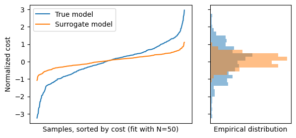
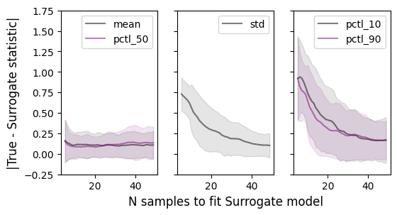

# grid-planner: Methods for efficient robust tranmission planning
## About
Planning electricity transmission systems under uncertainty presents significant computational challenges given the high model resolution and large sample set necessary to estimate distributions of economic benefits. This work presents two scenario selection methods to minimize the subset of scenarios evaluated in a production cost simulation while preserving the moments of the full sample distribution. The first method uses a linear model to estimate the relationship between the scenario sub-set and economic benefits. The second method takes an active-learning approach using a Gaussian process model to improve the cost distribution estimate iteratively.  To demonstrate these methods, we use a 96-bus synthetic network of the Western Electricity Coordinating Council (WECC) to assess the economic benefits of developing a High Voltage Direct Current (HVDC) transmission line in California. Our active learning scenario selection methodology can approximate the cost-benefit distribution within 25-50 samples, a reduction from a 500-sample complete scenario set, representing 90-95\% computational savings. We also find that the optimal methods we explore approximate these cost-benefit distributions significantly better than baselines of randomly selected sample points. This work is parter of a larger collaboration with Kamran Tehranchi

## Using this repo
This repo was built for academic research and not production code, however many of the functions in the [code](code/) folder may be useful for Gaussian Process modeling ([utils_actlearn](code/utils_actlearn/)), D-optimal sample design ([utils_dopt.py](code/utils_dopt.py)), and Variational Autoencoding ([utils_vae.py](code/utils_vae/)).

## Results
We make two takeaways in this work. First, we find that both of the surrogate models are able to approximate the cost model after only 25-50 samples. Assuming that an adequate true distribution can be generated with 500 samples, this represents computational savings of $90-95\%$. While the linear model is not able to simulate the tails of the true distribution well, the Gaussian process model successfully approximates the outer percentiles (5th and 95th).

Second, we find that optimal sample selection methods for fitting both surrogate models can generate surrogate distributions significantly closer to the true distribution than random sampling for fitting surrogate models.

We present our results in figures below. The first set of figures compare the true distribution to the surrogate distribution, fit with 50 samples. The next set of figures show how the difference in the distribution statistics evolve as the surrogate models are fit with more sample points; uncertainty bands represent a 95% confidence interval, generated by bootstrapping.

### True vs. Surrogate distributions
#### D-optimal surrogate model

#### Gaussian process surrogate model

| | Baseline | Model|
| --- | --- | --- |
| D-optimal |  | | 
| Active learning: Taylor | | | 
| Active learning: Particle | | | 

### Absolute differences in statistics from distributions generated by one-shot selection
#### D-optimal surrogate model

#### Gaussian process surrogate model

